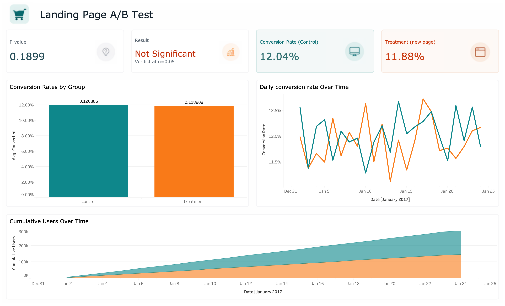

# Landing Page A/B Test Analysis

> **Bottom line:** The new landing page did not significantly improve conversion. **Recommendation: do not ship.**

**🔗 [Interactive Tableau Dashboard](PASTE_YOUR_URL_HERE)**

---

## The Business Question

A mid-sized e-commerce retailer ran a 3-week A/B test of a redesigned landing page, expecting to improve conversion rate. Before committing engineering resources to a full rollout, the product team needs one answer:

> **Did the new landing page actually increase conversion, or were any observed differences just random noise?**

## Executive Summary

| Metric | Value |
|---|---|
| Test duration | 21 days (Jan 2–24, 2017) |
| Users analyzed (after cleaning) | 290,584 |
| Control conversion rate | **12.04%** |
| Treatment conversion rate | **11.88%** |
| Absolute difference | −0.16 percentage points |
| Relative lift | **−1.31%** |
| Statistical test | Two-proportion z-test |
| P-value | **0.1899** |
| Verdict at α=0.05 | **Not statistically significant** |

## Recommendation

**Do not ship the new landing page.**

Three reasons:

1. **No statistical evidence of improvement.** With a p-value of 0.19, there is a 19% chance of observing this difference (or larger) purely by random variation if the pages were truly equivalent. That is well above the 5% threshold standardly used to declare an effect real.

2. **Point estimate is negative.** The observed difference is −0.16 percentage points (treatment worse than control). Even setting statistical significance aside, there is no positive case for rolling out a page that performed worse in the test.

3. **Business impact of shipping would be negative.** At 5M annual visitors and a $50 average order value, the observed point estimate translates to roughly **−$395,000 in annual revenue**. Plus the cost of engineering a rollout that doesn't move the metric.

## Why this is a useful result

This test successfully caught a change that does not improve conversion **before** engineering resources were spent on a full rollout. 

## Methodology

### Data cleaning

Starting with 294,478 rows, I identified and handled two data quality issues:

| Issue | Rows affected | Decision |
|---|---|---|
| Group assignment didn't match landing page shown | 3,893 | **Dropped.** Can't attribute outcomes when we don't know which experience the user had. |
| User appeared more than once in the data | 3,894 | **Kept first visit only.** Statistical independence assumption requires one observation per user. |

**Final analysis-ready dataset:** 290,584 users across 21 days, with group balance preserved at essentially 50/50 (145,274 control vs. 145,310 treatment).

### Statistical test

For comparing conversion rates between two groups, I used a **two-proportion z-test** (two-sided).

- **Null hypothesis (H₀):** Control and treatment have the same true conversion rate.
- **Alternative hypothesis (H₁):** The true conversion rates differ.

**Result:** Z = 1.31, p = 0.1899. We fail to reject the null hypothesis.

### 95% Confidence Intervals

- Control: [11.87%, 12.21%]
- Treatment: [11.71%, 12.05%]

The intervals overlap substantially which is a visual confirmation that we cannot distinguish the groups.

### Minimum detectable effect

For a redesigned landing page, a realistic minimum detectable effect would be a relative lift of ≥ +2%. Observed relative lift: **−1.31%**. The test is well-powered to detect a real 2% lift; the fact that it didn't find one is meaningful evidence of no effect.

## Suggested Next Steps for the Product Team

1. **Investigate *why* the new design didn't outperform.** User interviews, session recordings, or heatmap analysis may reveal whether specific elements of the redesign are confusing or off-putting.
2. **Consider more ambitious variations.** Small visual refreshes often fail to move conversion. Test bolder changes: new value propositions, different pricing displays, or simplified forms.
3. **If the new design has non-conversion benefits** (brand consistency, accessibility, mobile experience), it may still be worth shipping — but not as a conversion-improvement initiative. Frame the shipping decision honestly.

## Stack

- **Python** (pandas, numpy, statsmodels, matplotlib) — data cleaning, statistical testing
- **Jupyter Lab** — analysis notebooks
- **Tableau Public** — interactive dashboard
- **SciPy / statsmodels** — two-proportion z-test and confidence intervals

